# 🎨 Step 2: Sketch Your MVP Blueprint

<div align="center">


</div>

## 📖 Quick Navigation

<details>
<summary><b>📚 Table of Contents</b></summary>

### 🎯 Core Engineering Workflow
1. **[Choose Your Canvas](#-part-i-pick-your-weapon)** (2 min)
   - [Physical Whiteboard](#-option-a-old-school-whiteboard) - Tactile & collaborative
   - [TLDraw](#-option-b-tldraw-digital-freedom) - Quick digital sketching
   - [Excalidraw](#-option-c-excalidraw-ai-powered) - Text-to-diagram magic
   
2. **[Map Three Critical Perspectives](#-part-ii-triple-perspective-mapping)** (15 min)
   - [User Journey Flow](#-perspective-1-user-journey-mapping) - From stranger to advocate (5 min)
   - [System Architecture](#-perspective-2-system-architecture-design) - Think like an engineer (5 min)
   - [Website Structure](#-perspective-3-website-blueprint) - Pages & navigation (5 min)
   
3. **[Lock In Essential Elements](#-part-iii-non-negotiable-requirements)** (3 min)
   - [Email Capture Strategy](#-required-email-capture-mechanism) - Contact or newsletter
   - [Data Storage Backend](#-required-data-storage-solution) - Sheets vs Airtable
   - [Integration Blueprint](#-integration-blueprint) - How it all connects

### 💡 Pro Tips
- **[Think Like an Engineer](#-engineering-mindset)** - Problem decomposition
- **[Future Tools](#-beyond-tonight-power-tools)** - Next-level building blocks
- **[Architecture Patterns](#-battle-tested-architecture-patterns)** - Copy-paste templates
- **[Reality Check](#-prototype-vs-production)** - What we're really building

</details>

---

Time to think like an engineer. You're not just sketching pretty pictures - you're decomposing a problem into solvable components. Tonight's goal: create a foundation you can actually build on, not a full-scale application (that comes later).

---

## 🎯 Part I: Pick Your Weapon

> **⏰ Time:** 2 minutes  
> **🎯 Goal:** Choose your sketching tool based on your style


### 📝 Option A: Old School Whiteboard


<details>
<summary><b>📋 Whiteboard Warriors Unite</b></summary>

**You'll need:**
- Big whiteboard (or wall + sticky notes)
- Multiple colored markers
- Phone camera ready
- Space to move around

**Why choose this:**
- 🏃 Fastest ideation speed
- 👥 Great for collaboration
- 🎯 No tech barriers
- 💡 Encourages big thinking

**Pro move:** Use different colors for:
- 🔵 User actions
- 🟢 System responses
- 🔴 Pain points
- 🟡 Email capture points

</details>

---

### 💻 Option B: TLDraw (Digital Freedom)


<details>
<summary><b>🎨 Digital Canvas Setup</b></summary>

**Quick start:**
1. **Go to** [tldraw.com](https://tldraw.com)
2. **No signup** - immediate access
3. **Tools available:**
   - Rectangle tool (R)
   - Arrow tool (A)
   - Text tool (T)
   - Sticky notes (N)

**Power features:**
- 🔄 Infinite canvas
- 📸 Export as image/PDF
- 🔗 Share via link
- 🎨 Color coding built-in

**Keyboard shortcuts:**
```
R = Rectangle
A = Arrow
T = Text
N = Note
Z = Undo
Space = Pan
```

</details>

---

### 🤖 Option C: Excalidraw (AI-Powered)


<details>
<summary><b>🪄 AI-Assisted Diagramming</b></summary>

**The workflow:**
1. **Write** your flow in plain text (or dictate via [this CustomGPT](https://chatgpt.com/g/g-5O9oZiGOc-excalidraw-diagram-creator))
2. **Visit** [excalidraw.com](https://excalidraw.com)
3. **Use** Mermaid plugin or AI features
4. **Convert** text/Mermaid → Excalidraw visual diagram
5. **Refine** with drag & drop

**Example text input:**
```
User lands on homepage
User clicks "Get Started"
User fills email form
System validates email
System sends to Zapier
Zapier saves to Sheets
User sees success message
```

**AI converts to:** Beautiful flowchart! 🎨

</details>

---

## 🗺️ Part II: Triple Perspective Mapping

> **⏰ Time:** 15 minutes  
> **🎯 Goal:** Engineer's blueprint: User experience + System design + Website structure

### 👤 Perspective 1: User Journey Mapping


**Map the complete transformation: Stranger → Customer → Advocate**

<details>
<summary><b>🚀 The 8-Stage User Journey</b></summary>


</details>

<details>
<summary><b>🎯 Alternative: Emotional Journey Map</b></summary>



</details>

```mermaid
flowchart LR
    A[😕 Frustrated<br/>with Problem] -->|Searches| B[🤔 Curious<br/>about Solution]
    B -->|Lands| C[😊 Hopeful<br/>on Homepage]
    C -->|Reads| D[🤩 Excited<br/>by Features]
    D -->|Submits| E[📧 Committed<br/>Email Given]
    E -->|Receives| F[✅ Validated<br/>Email Confirmed]
    F -->|Uses| G[💡 Enlightened<br/>Problem Solved]
    G -->|Shares| H[📢 Advocate<br/>Telling Others]
    
    style A fill:#ffebee
    style C fill:#e8f5e9
    style E fill:#fff3e0
    style G fill:#e3f2fd
    style H fill:#f3e5f5
```

**🔑 Key Questions to Answer:**
- Where's the "aha!" moment?
- What triggers email submission?
- Which step has highest drop-off?
- What drives referrals?

---

### 🏗️ Perspective 2: System Architecture Design


**Design your technical blueprint: Frontend → Backend → Database**

```mermaid
graph TB
    subgraph "🎨 Frontend Layer"
        A[🌐 Landing Page<br/>Hero + Value Props]
        B[📝 Contact Form<br/>Name + Email]
        C[✅ Success Page<br/>Confirmation]
        D[📊 Dashboard<br/>User Portal]
    end
    
    subgraph "⚙️ Backend Layer"
        E[🔌 API Gateway<br/>Route Requests]
        F[🔐 Auth Service<br/>User Sessions]
        G[📨 Email Service<br/>Transactional]
        H[💼 Business Logic<br/>Core Features]
        I[🪝 Webhook Handler<br/>Form Processing]
    end
    
    subgraph "💾 Data Layer"
        J[(📊 Google Sheets<br/>Simple Storage)]
        K[(🗄️ Airtable<br/>Advanced DB)]
        L[(📈 Analytics<br/>User Tracking)]
    end
    
    subgraph "🔗 External Services"
        M[📧 SendGrid<br/>Email Delivery]
        N[⚡ Zapier<br/>Automation]
        O[📊 Google Analytics<br/>Metrics]
    end
    
    A -->|User Visits| E
    B -->|Form Submit| I
    I -->|Webhook| N
    N -->|Store Data| J
    N -->|Store Data| K
    N -->|Trigger Email| M
    G -->|Send Via| M
    A -->|Track Visit| O
    
    style A fill:#e3f2fd
    style B fill:#fff3e0
    style J fill:#e8f5e9
    style N fill:#f3e5f5
```

<details>
<summary><b>⚡ Full Stack Architecture</b></summary>



</details>

<details>
<summary><b>🔄 Detailed Data Flow Sequence</b></summary>


</details>

**🏛️ Architecture Checklist:**
- [ ] User-facing components
- [ ] Data processing flow
- [ ] Storage destination
- [ ] Integration points
- [ ] Error handling

---

### 🌐 Perspective 3: Website Blueprint


**Map every page and interaction: Homepage → Dashboard → Features**

```mermaid
graph TD
    A[🏠 Homepage] --> B[📋 Features]
    A --> C[💰 Pricing]
    A --> D[📞 Contact]
    A --> E[🔐 Login]
    
    E --> F[📊 Dashboard]
    F --> G[⚙️ Settings]
    F --> H[📈 Analytics]
    F --> I[🎯 Core Feature]
    
    I --> J[📝 Create New]
    I --> K[📂 View All]
    I --> L[✏️ Edit]
    I --> M[🗑️ Delete]
    
    A --> N[📧 Email Capture]
    N --> O[✅ Thank You]
    
    style A fill:#e3f2fd,stroke:#1976d2,stroke-width:3px
    style F fill:#fff3e0,stroke:#f57c00,stroke-width:3px
    style I fill:#e8f5e9,stroke:#388e3c,stroke-width:3px
```

<details>
<summary><b>🏗️ Website Structure Diagram</b></summary>



</details>

<details>
<summary><b>📱 Page-by-Page Breakdown</b></summary>

**Public Pages (No Login):**
```
/                    → Homepage (value prop + CTA)
/features            → Feature showcase
/pricing             → Plans & pricing
/contact             → Contact form
/login               → User authentication
/signup              → Registration
/forgot-password     → Password reset
```

**Protected Pages (Login Required):**
```
/dashboard           → User home
/dashboard/profile   → User settings
/dashboard/billing   → Subscription management
/dashboard/[feature] → Your core functionality
```

**Utility Pages:**
```
/privacy             → Privacy policy
/terms               → Terms of service
/404                 → Not found
/success             → Form success
```

</details>

<details>
<summary><b>🎨 Interactive Elements Map</b></summary>


</details>

**🌐 Website Planning Checklist:**
- [ ] Homepage with clear value prop
- [ ] Email capture placement
- [ ] Login/signup flow
- [ ] Core feature pages
- [ ] User dashboard
- [ ] Mobile-responsive plan

---

## ✅ Part III: Non-Negotiable Requirements

> **⏰ Time:** 3 minutes  
> **🎯 Goal:** Ensure critical MVP elements are included

### 📧 Required: Email Capture Mechanism


<details>
<summary><b>📨 Email Capture Strategies</b></summary>

**Option 1: Contact Form**
```html
<!-- Minimal friction approach -->
<form>
  <input type="text" placeholder="Your Name" required>
  <input type="email" placeholder="your@email.com" required>
  <textarea placeholder="How can we help?"></textarea>
  <button>Get In Touch</button>
</form>
```

**Option 2: Newsletter Signup**
```html
<!-- Value exchange approach -->
<div class="newsletter">
  <h3>🎁 Get Our Free Guide</h3>
  <input type="email" placeholder="your@email.com">
  <button>Send Me The Guide</button>
  <p>Join 1,000+ subscribers</p>
</div>
```

**Placement Power Ranking:**
1. 🥇 Above the fold in hero
2. 🥈 After value proposition
3. 🥉 Exit intent popup
4. 📍 Sticky header bar
5. 🦶 Footer (always there)

</details>

---

### 💾 Required: Data Storage Solution


<details>
<summary><b>📊 Google Sheets Deep Dive</b></summary>

**Perfect for:**
- First 1,000 signups
- Simple email + name
- Quick CSV exports
- Zero monthly cost

**Setup preview:**
| Timestamp | Email | Name | Source | Status |
|-----------|-------|------|---------|---------|
| 2024-01-01 9:00 | user@example.com | John Doe | Landing Page | New |

**Limitations:**
- 10 million cells max
- No relational data
- Basic automation only

</details>

<details>
<summary><b>🗄️ Airtable Deep Dive</b></summary>

**Perfect for:**
- Complex data relationships
- Multiple data types
- Advanced filtering
- API integrations

**Power features:**
- Form views
- Kanban boards
- Calendar views
- Automation rules
- Mobile apps

**When to upgrade:**
- Need user profiles
- Want CRM features
- Building workflows
- Team collaboration

</details>

---

## 📊 Visual Vocabulary Cheat Sheet

<details>
<summary><b>🎨 Standard Diagramming Symbols</b></summary>

```
Universal Symbols:
═══════════════════
□ Rectangle = Screen/Page/Component
◇ Diamond = Decision/Choice Point
○ Circle = Start/End State
→ Arrow = Flow Direction/Navigation
⭐ Star = Critical Touch Point
☁ Cloud = External Service/API

User Elements:
═════════════
👤 Person Icon = User Action
👁️ Eye = User Views/Reads
👆 Finger = User Clicks/Taps
⌨️ Keyboard = User Types
📧 Envelope = Email Interaction

System Elements:
═══════════════
⚙️ Gear = Backend Process
🔌 Plug = API/Integration
💾 Disk = Database/Storage
🔐 Lock = Authentication
📊 Chart = Analytics/Data
🪝 Hook = Webhook Endpoint

Status Indicators:
═════════════════
✅ Checkmark = Success State
❌ X Mark = Error State
⏳ Hourglass = Loading/Processing
🔄 Refresh = Retry/Loop
⚡ Lightning = Automation/Trigger
```

</details>

---

## 🏗️ Battle-Tested Architecture Patterns

### 🎯 Pattern 1: Simple Lead Capture

```mermaid
graph LR
    subgraph "What Users See"
        A[🏠 Landing Page]
        B[📧 Email Form]
        C[✅ Thank You]
    end
    
    subgraph "Behind the Scenes"
        D[🪝 Webhook]
        E[⚡ Zapier]
        F[(📊 Sheets)]
    end
    
    A --> B
    B --> D
    D --> E
    E --> F
    B --> C
    
    style A fill:#e3f2fd
    style B fill:#fff3e0
    style F fill:#e8f5e9
```


<details>
<summary><b>📋 The "Quick Win" Architecture</b></summary>



**Build timeline:**


</details>

---

### 🚀 Pattern 2: Interactive SaaS MVP


<details>
<summary><b>💼 The "Real Product" Architecture</b></summary>


**Component breakdown:**
- 🎨 5 unique pages
- 🔐 User authentication
- 💾 User data persistence
- 📊 Basic analytics
- 💳 Payment ready

</details>

---

## 🎯 MVP Architecture Decision Tree

```mermaid
graph TD
    A[What's Your MVP Goal?] --> B{Primary Purpose?}
    
    B -->|Validate Interest| C[🎯 Lead Capture]
    B -->|Show Functionality| D[🚀 Interactive Demo]
    B -->|Sell Content| E[📚 Content Platform]
    
    C --> F{Expected Users?}
    F -->|< 1000| G[✅ Google Sheets]
    F -->|> 1000| H[✅ Airtable]
    
    D --> I{User Accounts?}
    I -->|Not Needed| J[✅ Local Storage]
    I -->|Required| K[✅ Auth Service]
    
    E --> L{Content Type?}
    L -->|Articles/Blogs| M[✅ Markdown/CMS]
    L -->|Courses/Videos| N[✅ LMS Platform]
    
    style A fill:#e3f2fd,stroke:#1976d2,stroke-width:3px
    style C fill:#e8f5e9
    style D fill:#fff3e0
    style E fill:#f3e5f5
```

<details>
<summary><b>🤔 Which Architecture Fits Your Idea?</b></summary>



**Quick Decision Framework:**

| If You're Building... | Choose This Pattern | Time Investment |
|----------------------|---------------------|-----------------|
| Email list for newsletter | Lead Capture + Sheets | 30 minutes |
| SaaS free trial funnel | Interactive Demo + Auth | 90 minutes |
| Course pre-launch | Content + Payment | 60 minutes |
| Community platform | Full Stack + Forum | 2+ hours |

</details>

---

## 💡 Sketch Like a Pro

<details>
<summary><b>🚨 Common Sketching Mistakes to Avoid</b></summary>

### ❌ Rookie Mistakes

1. **Too Much Detail Too Soon**
   - Bad: Designing button colors
   - Good: Mapping user flow

2. **Forgetting Mobile Users**
   - Bad: Desktop-only thinking
   - Good: Mobile-first approach

3. **No Email Capture**
   - Bad: Beautiful site, no leads
   - Good: Multiple capture points

4. **Complex First Version**
   - Bad: 20 features planned
   - Good: 1 core feature nailed

### ✅ Pro Moves

1. **Number Everything**
   ```
   1. User lands
   2. User clicks CTA
   3. User fills form
   ```

2. **Mark Critical Points**
   ```
   ⭐ Email capture here
   💰 Payment happens here
   🎯 Main value here
   ```

3. **Plan for Errors**
   ```
   What if email invalid?
   What if payment fails?
   What if API is down?
   ```

4. **Think in Phases**
   ```
   Phase 1: Email capture only
   Phase 2: Add user accounts
   Phase 3: Add payment
   ```

</details>

---

## 🧠 Engineering Mindset

<details>
<summary><b>🔧 Think Like a Builder, Not a Dreamer</b></summary>

### Problem Decomposition 101

**Break your MicroSaaS into atoms:**


**Engineering Questions to Ask:**
1. **Inputs:** What data do I need from users?
2. **Storage:** Where does this data live?
3. **Processing:** What happens to the data?
4. **Outputs:** What do users get back?
5. **Triggers:** What causes things to happen?
6. **States:** What are all possible conditions?

### From Idea to Implementation

| Dreamer Thinks... | Engineer Asks... |
|-------------------|------------------|
| "AI-powered tool" | What API? What prompts? What's the cost per call? |
| "Real-time sync" | WebSockets? Polling? How often? |
| "Beautiful UI" | What components? What framework? Mobile-first? |
| "Scalable backend" | What database? What hosting? What limits? |

</details>

---


## 🎬 Before Moving On

**Your engineering blueprint must include:**

- [ ] **User Journey** (all 8 stages mapped)
- [ ] **System Architecture** (components, triggers, data flow)
- [ ] **Website Structure** (all pages and navigation)
- [ ] **Email Capture** marked with ⭐ on all diagrams
- [ ] **Data Storage** choice (Sheets or Airtable)
- [ ] **Problem Decomposition** (inputs → processing → outputs)
- [ ] **Integration Points** (where systems connect)
- [ ] **Photo/Export** saved for reference

### 🏁 Engineering Readiness Check

Ask yourself:
- Can I explain what happens when a user clicks "Submit"?
- Do I know what data I'm storing and why?
- Have I identified all the pages I need to build?
- Could another engineer understand my diagrams?
- Am I solving a real problem, not building a feature?

---

<div align="center">

### 🎉 Engineering Blueprint Complete!

You've decomposed your MicroSaaS like a pro. You understand the problem, mapped the solution, and designed the experience. You're thinking like an engineer, not just a dreamer.

### 🚀 Ready for Step 3?

Time to design your website with AI assistance → [**Step 3: Design the Website**](./3-design.md)

**Remember:** Tonight we build the foundation. The full MicroSaaS comes later with the power tools! 💪

</div>
